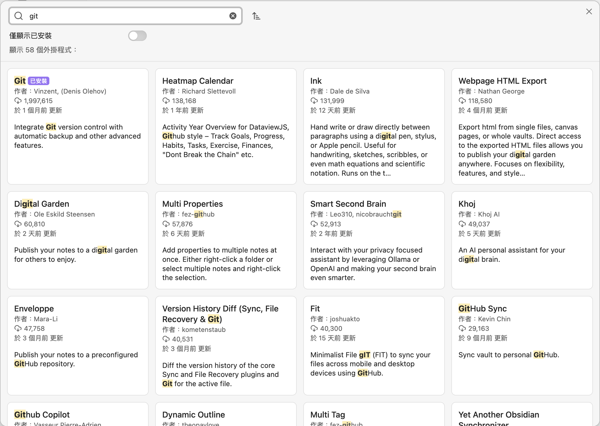
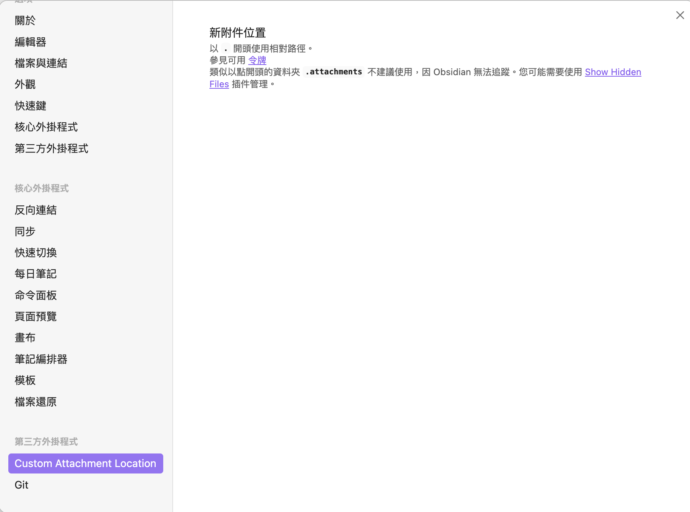
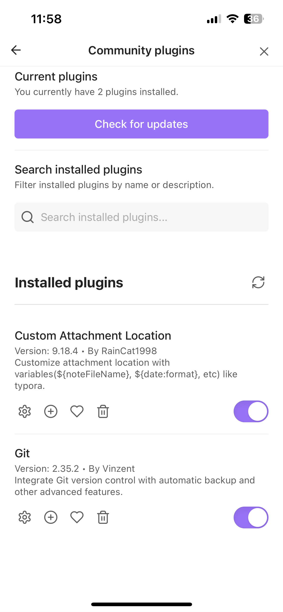
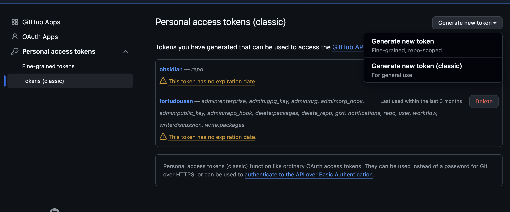
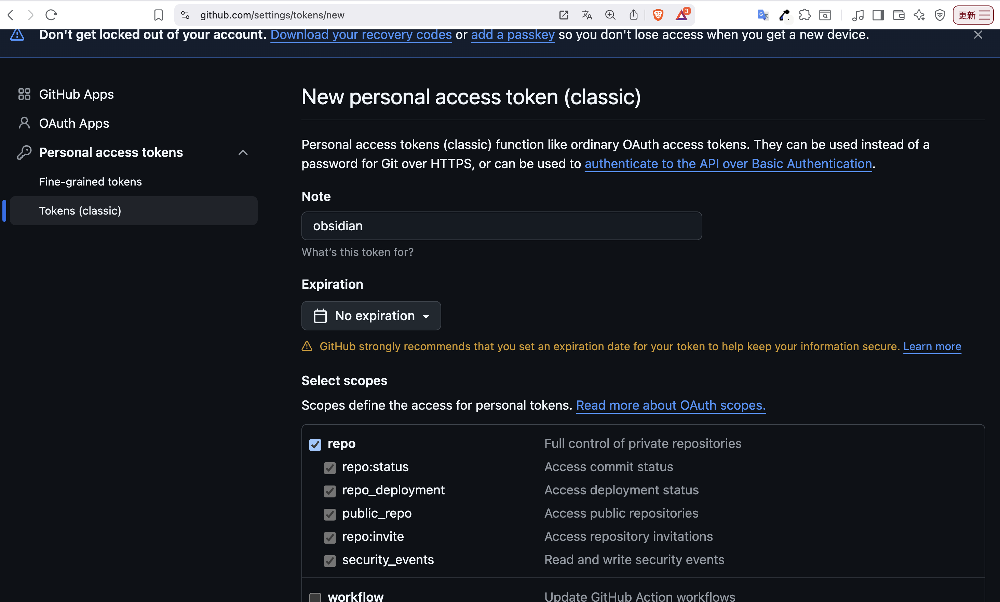
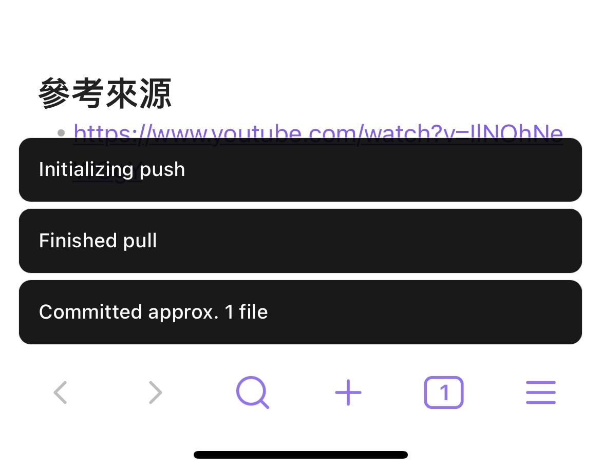

本文章是在已經完成用 jekyll 推上 github.io 的基礎上進行的設置，如果還沒有設定的話請參考 [建立你自己的 github.io](https://amoeric.github.io/create_your_github_io/)、[jekyll 架構介紹](https://amoeric.github.io/jekyll-architecture/)，也歡迎點擊 jekyll 標籤看更多相關文章。

整體流程會是：
- 編輯文章 > 自動 commit & push > github action build jekyll > 更新 github.io


以下記錄如何用 macOS 與 iOS 的 Obsidian 第三方插件，完成跨裝置同步並隨時隨地編輯自己的 github.io。

## Git
在 Obsidian 中如果要完成跨裝置同步的功能，本文的做法是統一上傳到 GitHub，並透過插件自動 commit、push、pull，以下記錄安裝步驟。

### 安裝
首先到 obsidian 的設定 > 第三方外掛程式 > 社群外掛程式

搜尋 git




安裝後再到插件裡面設定
1. 開啟 Auto commit-and-sync after stopping file edits
2. Auto commit-and-sync interval (minutes) 設定停止編輯多少分鐘後自動 commit 並上傳
3.  滑到下方的「pull」區塊，把 pull on startup 打開


設定完成後，Obsidian 就會在停止編輯幾分鐘後自動 commit & push。因為有啟用 Pull on startup，也不用擔心同步的問題。

## Custom Attachment Location

在 obsidian 中，預設的圖片會像是這種格式

```
![[xxx.png]]
```


但是這種格式在 jekyll 的架構中是沒辦法讀取的， jekyll 的圖檔是放在根目錄的 `assets/images/` 底下，在這裡就要用到 Custom Attachment Location 這個插件去解決圖檔路徑問題。

### 安裝
一樣到 obsidian 的設定 > 第三方外掛程式 > 社群外掛程式，搜尋 Custom Attachment Location 並且安裝。

你很有可能會看到這個畫面，不知道為什麼無法手動修改參數。



不過沒關係，我們可以透過修改 config 的方式去達成一樣的效果。

請到專案中的 .obsidian/plugins/obsidian-custom-attachment-location/data.json

```json
{
  "attachmentFolderPath": "assets/images/${noteFileName}",
  "attachmentRenameMode": "All",
  "collectAttachmentUsedByMultipleNotesMode": "Skip",
  "collectedAttachmentFileName": "",
  "customTokensStr": "",
  "defaultImageSize": "",
  "defaultImageSizeDimension": "width",
  "duplicateNameSeparator": " ",
  "emptyAttachmentFolderBehavior": "DeleteWithEmptyParents",
  "excludePaths": [],
  "excludePathsFromAttachmentCollecting": [],
  "generatedAttachmentFileName": "${noteFileName}-${date:YYYYMMDDHHmmss}",
  "includePaths": [],
  "jpegQuality": 0.8,
  "markdownUrlFormat": "../assets/images/${noteFileName}/${generatedAttachmentFileName}",
  "renamedAttachmentFileName": "",
  "shouldConvertPastedImagesToJpeg": false,
  "shouldDeleteOrphanAttachments": false,
  "shouldRenameAttachmentFiles": true,
  "shouldRenameAttachmentFolder": true,
  "shouldRenameCollectedAttachments": false,
  "specialCharacters": "#^[]|*\\<>:?/",
  "specialCharactersReplacement": "-",
  "timeoutInSeconds": 5,
  "treatAsAttachmentExtensions": [
    ".excalidraw.md"
  ],
  "version": "9.18.4"
}
```

| 設定項 | 原本 | 修改後 |
| --- | --- | --- |
| attachmentFolderPath | `./assets/images` | `assets/images/${noteFileName}` |
| attachmentRenameMode | Only pasted images | All |
| generatedAttachmentFileName | `${noteName}-${date:...}` | `${noteFileName}-${date:YYYYMMDDHHmmss}` |
| markdownUrlFormat | (空) | `../assets/images/${noteFileName}/${generatedAttachmentFileName}` |
| shouldRenameAttachmentFiles | false | true |

  效果：
  - 圖片會存到 assets/images/筆記名稱/ 資料夾（從根目錄開始）
  - 檔名格式：筆記名稱-時間戳.png
  - Markdown 路徑使用 ../assets/images/...，讓 Obsidian 和 Jekyll 都能正確顯示圖片


## 手機端

### obsidian sync

iOS 手機的做法：
- mac airdrop 專案給手機
- 手機指定儲存到 obsidian 資料夾內

做完後就可以在 obsidian vaults 找到專案了

另外兩種方式：
- Working Copy app (20 鎂買斷) 
- 每個月花 8 鎂給 obsidian

另外兩種方式也可以試試看。手機 Obsidian 開啟 vault 後，就可以接著進行以下設定。

### Github 設定

先到 iOS Obsidian 第三方插件 Git 設定「Authentication/commit author」





### Personal Access Token
這 token 可以在 [github token](https://github.com/settings/tokens) 頁面的 Token (classic) > Generate new token > Generate new token (classic)



token 到期日自己設定、把 repo 打勾，並送出即可。



記得把 token 貼到 Git 第三方插件裡面

設定完成後，手機就會自動 sync & push 到 GitHub 了



## 參考來源
- [https://www.youtube.com/watch?v=IlNOhNeWGgY](https://www.youtube.com/watch?v=IlNOhNeWGgY)