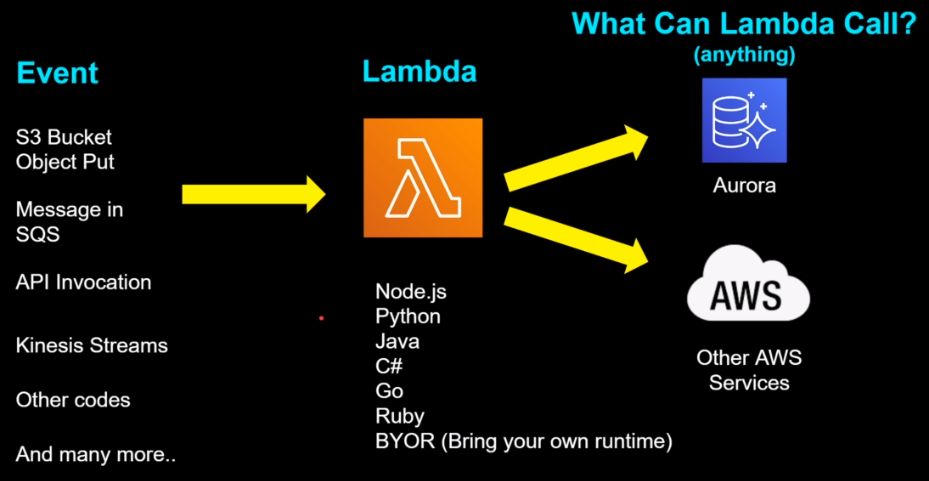
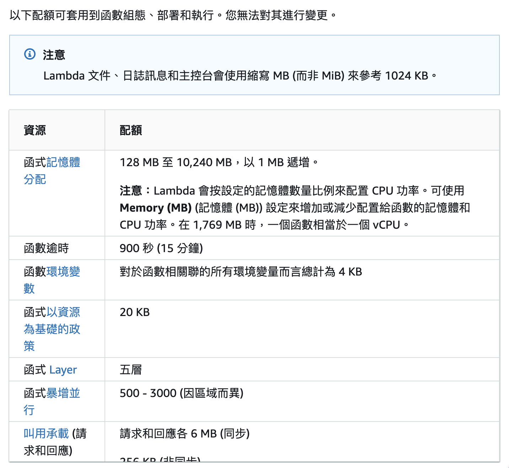

## Lambda

### 什麼是 lambda ?
> AWS Lambda 是一項運算服務，可讓您執行程式碼，無需佈建或管理伺服器。
Lambda 在高可用性的運算基礎設施上執行您的程式碼，並執行所有運算資源的管理，包括伺服器與作業系統維護、容量佈建與自動擴展以及記錄。



### Lambda 功能

- 用自訂邏輯擴展其他 AWS 服務
- 僅需按實際用量付費
    - 使用 Lambda 函數時，您只需為處理的請求及執行程式碼所需的運算時間付費。
- 靈活的資源模型
    - 選擇要分配給函數的記憶體數量，AWS Lambda 便會按比例分配 CPU 功率、網路頻寬和磁碟輸入/輸出 (I/O)。
- 支持多種語言：AWS Lambda 支持多種常用的編程語言，例如: Node.js、Python、Java、Go 等。

[AWS Lambda 功能 -> https://aws.amazon.com/tw/lambda/features/](https://aws.amazon.com/tw/lambda/features/)

### Lambda 建立方式
- AWS Console
- CloudFormation / SAM(Serverless Application Model) / CDK
- AWS CLI

### Lambda 收費

免費
- 每月 1 百萬個請求
- 每月 400,000 GB-秒的運算時間

收費標準
- 會針對開的記憶體大小、tmp 暫存、請求數量、function執行時間...等等，來進行收費。
- [lambda 定價](https://aws.amazon.com/tw/lambda/pricing/)
- [lambda pricing-calculator](https://s3.amazonaws.com/lambda-tools/pricing-calculator.html)


### Memory 和 Timeout

Memory
- lambda 記憶體可以設定的範圍為 128 MB 到 10,240 MB，
- [分析 AWS 資源組態和使用率指標 -> AWS Compute Optimizer](https://docs.aws.amazon.com/zh_tw/compute-optimizer/latest/ug/what-is-compute-optimizer.html)

Timeout
- 預設 3 秒，可以設定的範圍為 1 秒到 15 分鐘


- 推薦文章 -> [你知道 AWS Lambda Memory 大小和 Performance 有關嗎？](https://koding.work/aws-lambda-performance-is-related-to-memory-size/)

### Lambda 限制
Lambda 也有些限制必須遵守，像是 CC 就遇到了 zip 檔案解壓縮後超過 250 MB的限制。





- [Lambda 配額](https://docs.aws.amazon.com/zh_tw/lambda/latest/dg/gettingstarted-limits.html)


### Lambda Layer

- layer 的路徑需要加上 /opt
- 一個 function 最多 5 層 layer


EX: 如果要讀取 layer 中的 /lib/fonts 資料夾，則需要設定為 **/opt/lib/fonts**

> 建立圖層時，必須將其所有內容綁定到 .zip 檔案封存中。可以從 Amazon Simple Storage Service (Amazon S3) 或本機電腦中將 .zip 封存檔上傳到您的層。設定函數的執行環境時，Lambda 會將圖層內容擷取到 /opt 目錄中。

### cloudformation

- [cloudformation 概念](https://docs.aws.amazon.com/zh_tw/AWSCloudFormation/latest/UserGuide/cfn-whatis-concepts.html)

-------------

## Serverless Framework

serverless framework 會透過 serverless.yml 檔來建立 cloudformation template

> We envision a world where developers can build and scale more than ever, all with the least amount of maintenance.
At Serverless we are creating the tools for that.

[https://www.serverless.com/about](https://www.serverless.com/about)

## 專案建立

### 架構圖


安裝 serverless framework
```bash
npm install -g serverless
```

#### 建立專案
serverless template
```bash
serverless
```


或者直接 create
```bash
serverless create --template aws-nodejs --path serverless-demo
```

需要 AWS key

```bash
export AWS_ACCESS_KEY_ID=<your-key-here>
export AWS_SECRET_ACCESS_KEY=<your-secret-key-here>
```

### 常見 serverless.yml 配置

- ${self:xxx.xxx}
```yaml
${self:provider.stage}
${self:custom.exportName}

# yml
provider:
  stage: ${opt:stage, 'dev'}

custom:
  exportName: lambda-function
```

- ${sls:stage}
```yaml
${opt:stage, self:provider.stage, "dev"}
```

- ${opt:xxx}
```yaml
${opt:stage, 'dev'}

# command line
serverless deploy --stage staging
```

[官方文件看更多 variables 用法](https://www.serverless.com/framework/docs/providers/aws/guide/variables)

### image function 配置

```dockerfile
# Dockerfile
FROM public.ecr.aws/lambda/nodejs:12

COPY app.js ./

# You can overwrite command in `serverless.yml` template
CMD ["app.handler"]
```

```yaml
provider:
  name: aws
  ecr:
    # In this section you can define images that will be built locally and uploaded to ECR
    images:
      appimage:
        path: ./

functions:
  hello:
    image:
      name: appimage
```

- [serverless framework -> Container Image Support for AWS Lambda](https://www.serverless.com/blog/container-support-for-lambda)

#### 在 local 測試 image function

- [https://docs.aws.amazon.com/lambda/latest/dg/images-test.html](https://docs.aws.amazon.com/lambda/latest/dg/images-test.html)

----

## 相關連結
AWS 官方文件
- [什麼是 AWS Lambda？](https://docs.aws.amazon.com/lambda/latest/dg/welcome.html)
- [lambda 功能](https://aws.amazon.com/tw/lambda/features/)
- [Lambda 配額](https://docs.aws.amazon.com/lambda/latest/dg/gettingstarted-limits.html)
- [lambda 定價](https://aws.amazon.com/tw/lambda/pricing/)
- [建立和共用 Lambda 層](https://docs.aws.amazon.com/zh_tw/lambda/latest/dg/configuration-layers.html)
- [搭配使用 Lambda 與 API Gateway](https://docs.aws.amazon.com/zh_tw/lambda/latest/dg/services-apigateway-tutorial.html)
- [教學課程：搭配使用 Lambda 與 API Gateway](https://docs.aws.amazon.com/zh_tw/lambda/latest/dg/services-apigateway-tutorial.html#services-apigateway-tutorial-function)
- [AWS CloudFormation 如何運作？](https://docs.aws.amazon.com/AWSCloudFormation/latest/UserGuide/cfn-whatis-howdoesitwork.html)
- [Node.js 中的 AWS Lambda 函數處理常式](https://docs.aws.amazon.com/zh_tw/lambda/latest/dg/nodejs-handler.html)

其他文章
- [AWS Serverless 學習筆記 - 初探 AWS Lambda](https://godleon.github.io/blog/Serverless/AWS-Serverless_Fundamental/)
- [Serverless Framework 鐵人賽文章](https://ithelp.ithome.com.tw/articles/10304188?sc=iThelpR)
- [使用 Node.js + serverless framework + AWS Lambda 打造可擴展、更穩定而且更經濟的架構](https://medium.com/visuallylab/%E4%BD%BF%E7%94%A8-node-js-serverless-framework-aws-lambda-%E6%89%93%E9%80%A0%E5%8F%AF%E6%93%B4%E5%B1%95-%E6%9B%B4%E7%A9%A9%E5%AE%9A%E8%80%8C%E4%B8%94%E6%9B%B4%E7%B6%93%E6%BF%9F%E7%9A%84%E6%9E%B6%E6%A7%8B-6a54b51b8988)


## AWS

### Secrets Manager
- [什麼是 AWS Secrets Manager？](https://docs.aws.amazon.com/zh_tw/secretsmanager/latest/userguide/intro.html)
- [AWS Systems Manager Parameter Store](https://docs.aws.amazon.com/zh_tw/systems-manager/latest/userguide/systems-manager-parameter-store.html)
- [AWS Secrets Manager vs Systems Manager Parameter Store](https://tutorialsdojo.com/aws-secrets-manager-vs-systems-manager-parameter-store/)

---
## 其他連結
- [serverless official repo](https://github.com/serverless/serverless)
- [serverless framework official doc](https://www.serverless.com/framework/docs)
