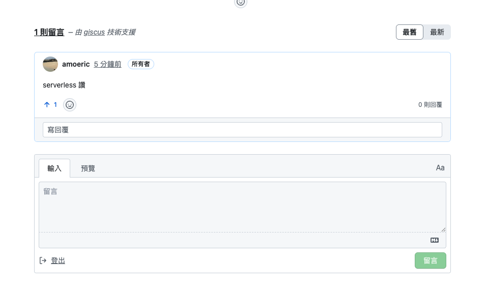
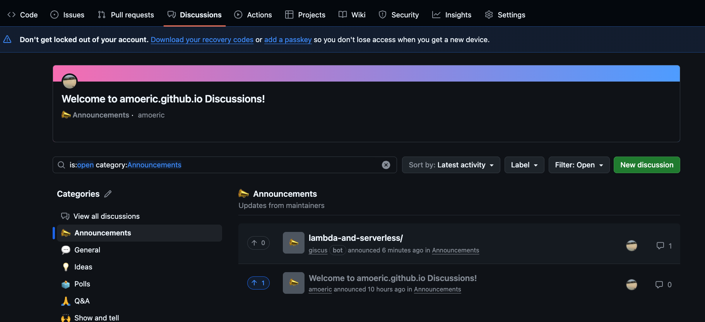

之前寫過一篇 [Disqus 的安裝教學]()，但後來發現 Disqus 免費版會顯示廣告，對讀者體驗不太好。最近發現了 Giscus 這個替代方案，完全免費、無廣告，而且是基於 GitHub Discussions，對工程師來說超方便！在此紀錄安裝過程。

# Giscus 是什麼？

Giscus 是一個利用 GitHub Discussions 實現的留言系統，讀者只要有 GitHub 帳號就能留言。對於技術部落格來說，讀者大多都有 GitHub 帳號，所以非常適合！

**優點：**
- 完全免費、無廣告
- 留言會存在你的 GitHub repo 裡
- 支援 Markdown 語法
- 支援表情符號 reactions
- 深色/淺色主題切換

# 安裝前準備

在開始之前，需要先確認以下條件：

1. 你的 GitHub repo 必須是 **Public**
2. 需要開啟 repo 的 **Discussions** 功能

----

# 安裝步驟

## 步驟一：開啟 GitHub Discussions

到你的 GitHub repo → Settings → Features → 勾選 **Discussions**

這樣就開啟了！

## 步驟二：安裝 Giscus App

到 [https://github.com/apps/giscus](https://github.com/apps/giscus) 安裝 Giscus App

1. 點擊 **Install**
2. 選擇 **Only select repositories**
3. 選擇你的 Jekyll repo（例如：`username.github.io`）
4. 點擊 **Install**

## 步驟三：取得設定代碼

到 [giscus.app](https://giscus.app/zh-TW) 設定頁面

1. 在「儲存庫」欄位輸入你的 repo（例如：`username/username.github.io`）
2. 「Discussion 分類」選擇 **Announcements**（或你喜歡的分類）
3. 其他設定可以依需求調整
4. 頁面下方會自動產生一段 `<script>` 代碼

產生的代碼會長得像這樣：

```html
<script src="https://giscus.app/client.js"
        data-repo="your-username/your-repo"
        data-repo-id="R_xxxxxx"
        data-category="Announcements"
        data-category-id="DIC_xxxxxx"
        data-mapping="pathname"
        data-strict="0"
        data-reactions-enabled="1"
        data-emit-metadata="0"
        data-input-position="bottom"
        data-theme="light"
        data-lang="zh-TW"
        crossorigin="anonymous"
        async>
</script>
```

## 步驟四：加入 Jekyll

在 `_includes` 資料夾新增或修改 `comments.html`，把上面的代碼貼進去：

```html
<!-- Giscus Comments -->
<div id="comments" class="mt-5">
    <h4 class="font-weight-bold mb-4">留言</h4>
    <!-- 把 giscus.app 產生的 script 貼在這裡 -->
</div>
```

然後在文章的 layout（通常是 `_layouts/post.html`）加入：

```html

    

```

這樣就完成了！


----

留言的內容可以在 repo 裡面的 discussions 查看，giscus 會自動依照文章名稱做分類




----

# 結論

Giscus 設定起來比 Disqus 簡單很多，而且完全免費無廣告，留言還會存在自己的 GitHub repo 裡面，超讚的！如果你也是用 GitHub Pages 架部落格的話，強烈推薦換成 Giscus。

## 參考連結
- [Giscus 官網](https://giscus.app/zh-TW)
- [Giscus GitHub](https://github.com/giscus/giscus)
